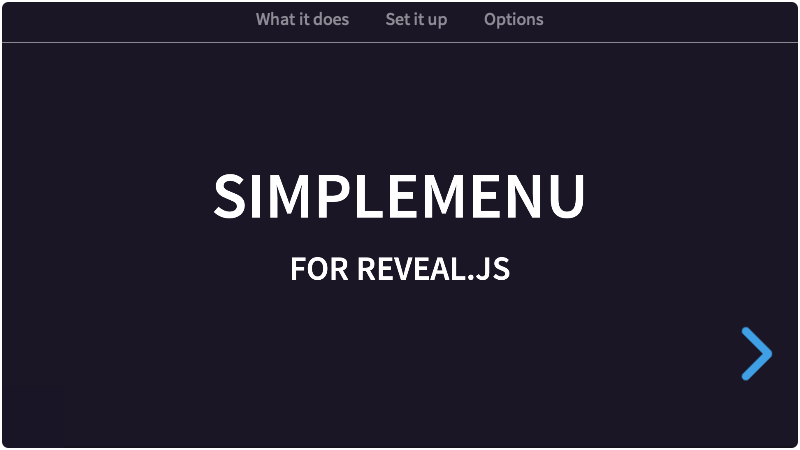

# Simplemenu
A simple menu for [Reveal.js](https://revealjs.com)

[](https://martinomagnifico.github.io/reveal.js-simplemenu/demo.html)

In Powerpoint you can make slides with a nice bottom- or top bar in which ***the active menu item is highlighted***. This menu works in the same way, but automatically. 

[Demo with bar on top](https://martinomagnifico.github.io/reveal.js-simplemenu/demo.html)

[Demo with bar on bottom](https://martinomagnifico.github.io/reveal.js-simplemenu/demo-bottom.html)

[Demo with select by name](https://martinomagnifico.github.io/reveal.js-simplemenu/demo-name.html)

[Demo with auto-generated menu](https://martinomagnifico.github.io/reveal.js-simplemenu/demo-auto.html)

### What it does
- Make menu items of your vertical stacks (top-level sections).
- Moving to another vertical stack (by whatever navigation) will automatically update the current menu item.
- Clicking an item in the menu will open the first section in the corresponding vertical stack.
- Simplemenu can auto-generate the menu, using section names (ID's give ugly button names). See the option 'auto' in options


It's easy to set up, but expects a few things:

- Menu items can only be top-level sections: regular horizontal slides or vertical stacks.
- There has to be an element that will hold the links. By default this selector is the class `menu`. The selector can be changed in the Simplemenu options.
- Inside this main menu, there have to be anchors with an href. These need to point to an ID of a top-level section. Reveal uses links with hashes to navigate, so the link has to be written like that: `href="#/firstchapter"`.


## Installation

Copy the simplemenu folder to the plugins folder of the reveal.js folder, like this: `plugin/simplemenu`. Now add it to the dependencies of Reveal.js:


### JavaScript

The Simplemenu plugin has been rewritten for Reveal.js version 4.

If you want to use Simplemenu with an older version of Reveal, use the [1.0.2 version](https://github.com/Martinomagnifico/reveal.js-simplemenu/releases).

There are two JavaScript files for Simplemenu, a regular one, `simplemenu.js`, and a module one, `simplemenu.esm.js`. You only need one of them:


#### Regular 
If you're not using ES modules, for example, to be able to run your presentation from the filesystem, you can add it like this:

```html
<script type="text/javascript" src="dist/reveal.js"></script>
<script src="plugin/simplemenu/simplemenu.js"></script>
<script>
	Reveal.initialize({
		// ...
		plugins: [ Simplemenu ]
	});
</script>
```

#### As a module 
If you're using ES modules, you can add it like this:

```html
<script type="module">
	// This will need a server
	import Reveal from './dist/reveal.esm.js';
	import Simplemenu from './plugin/simplemenu/simplemenu.js';
	Reveal.initialize({
		// ...
		plugins: [ Simplemenu ]
	});
</script>
```

Simplemenu also works in setups with multiple Reveal instances.


## Setup

It is easy to set up your HTML structure for Simplemenu. To keep the Simplemenu on every slide, put it outside of the `.slides`: 

```html
<div class="menubar">
	<ul class="menu">
		<!-- Here's the menu -->
		<li><a href="#/firstchapter">First chapter</a></li>
		<li><a href="#/secondchapter">Second chapter</a></li>
		<li><a href="#/thirdchapter">Third chapter</a></li>
	</ul>
</div>
<div class="slides">
	...
</div>
```

The top-level sections (that should be in the menu) need to have an ID: 

```html
<div class="slides">
	<section id="firstchapter" name="First chapter">
		<section>
			<h2>This is 1</h2>
		</section>
		<section>
			<h4>Lorem ipsum dolor sit amet, consectetur adipiscing elit.</h4>
		</section>
	</section>
	<section id="secondchapter" name="Second chapter">
		<h2>This is 2, no child slides</h2>
	</section>
	<section id="thirdchapter" name="My third chapter">
		<section>
			<h2>This is 3</h2>
		</section>
		<section>
			<h4>Lorem ipsum dolor sit amet, consectetur adipiscing elit.</h4>
		</section>
	</section>
</div>
```
### The auto way

When using the `auto` option (see Configuration), you only need to add an empty menu, and give names to your sections.

```html
<div class="menubar">
    <ul class="menu"></ul>
</div>
<div class="slides">
    <section name="Menu item one">
        //...
    </section>
    <section name="Menu item two">
        //...
    </section>
    <section name="Menu item three">
        //...
    </section>
</div>
```


## Configuration

There are a few options that you can change from the Reveal.js options. The values below are default and do not need to be set if they are not changed.

```javascript
Reveal.initialize({
    // ...
    simplemenu: {
        menuclass: 'menu',
        activeclass: 'active',
        activeelement: 'li',
        selectby: 'id',
        auto: false
    },
    plugins: [ Simplemenu ]
});
```
* **`menuclass`**: This option sets the classname of the menu.
* **`activeclass`**: This option is the class an active menuitem gets.
* **`activeelement`**: This option sets the element that gets the active class. Change it if you directly want to style the `a`, for example. 
* **`selectby`**: The selectby option finds the currently active vertical stack by this. By default, it selects by ID, but it can also be set to `name`. In that case, Simplemenu will compare the text content of your links to the name of the section.
* **`auto`**: If set to true, the auto option will auto-generate a menu by the names of the sections.


## Like it?
If you like it, please star this repo.


## License
MIT licensed

Copyright (C) 2020 Martijn De Jongh (Martino)
