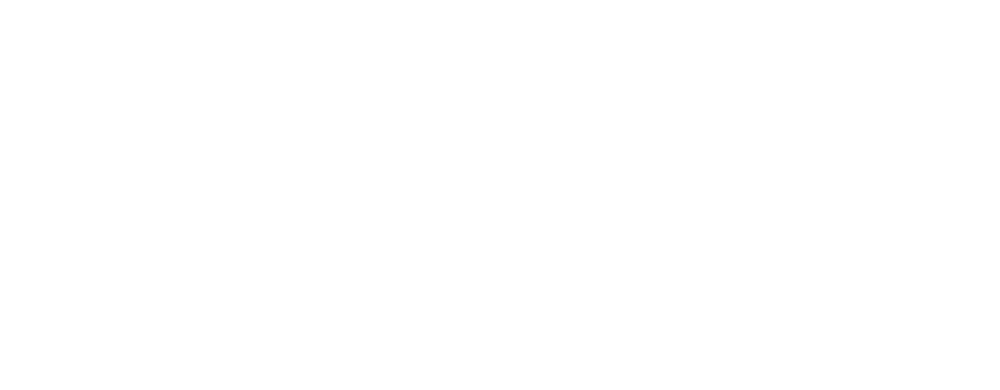

# Simplemenu

[](#) [](https://github.com/Martinomagnifico/reveal.js-simplemenu/archive/refs/heads/master.zip)

A simple menu for [Reveal.js](https://revealjs.com)

[](https://martinomagnifico.github.io/reveal.js-simplemenu/demo.html)

In Powerpoint you can make slides with a nice bottom- or top bar in which ***the active menu item is highlighted***. This menu works in the same way, but automatically. Simplemenu now also supports the Markdown syntax. Combined with the `barhtml` option, you don't have to edit the template in HTML at all.

-   [Demo with bar on top](https://martinomagnifico.github.io/reveal.js-simplemenu/demo.html)
-   [Demo with bar on bottom](https://martinomagnifico.github.io/reveal.js-simplemenu/demo-bottom.html)
-   [Demo with Markdown](https://martinomagnifico.github.io/reveal.js-simplemenu/demo-markdown.html)
-   [Demo, custom styling, including a logo](https://martinomagnifico.github.io/reveal.js-simplemenu/demo-custom.html)
-   [Demo, flat chapter navigation](https://martinomagnifico.github.io/reveal.js-simplemenu/demo-flat.html)
-   [Demo, manual setup, select by id](https://martinomagnifico.github.io/reveal.js-simplemenu/demo-manual-id.html)
-   [Demo, manual setup, select by data-name](https://martinomagnifico.github.io/reveal.js-simplemenu/demo-manual-dataname.html)

### What it does

-   Make menu items of your vertical stacks (top-level sections).
-   Moving to another vertical stack (by whatever navigation) will automatically update the current menu item.
-   Clicking an item in the menu will open the first section in the corresponding vertical stack.
-   Note: Menu items can only be top-level sections: regular horizontal slides or vertical stacks.

#### Auto mode

There is no longer an `auto-mode` that needs to be set in the options. Simplemenu can generate the menu, using sections with an attribute of `data-name`. If you add a menubar (manually or through the `barhtml` option) and an empty menu, Simplemenu will automatically populate it for you. You can also add such a menu anywhere else in the presentation, to serve as a Table Of Contents or an Agenda.

#### Manual mode

However, if you add a menu (in either a menubar or a standalone TOC menu), and manually add links to your sections to it, Simplemenu goes into 'manual' mode, and you have to take some things into account:

-   There has to be an element that will hold the links. By default this selector is the class `menu`. The selector can be changed in the Simplemenu options.
-   Inside this main menu, there have to be anchors with an href. These need to point to an ID of a top-level section. Reveal uses links with hashes to navigate, so the link has to be written like that: `href="#/firstchapter"`.

### Presentation structure



Simplemenu uses top-level slides for the menu item names. Nested slides in vertical stacks will then also use the name of the whole stack. This way you get chapters through which the user can navigate.

However, sometimes you'll want to limit your presentation to horizontal slides only. To still use 'chapters' with several slides, you can use the `flat` option. By default, it is set to `false`, but you can set it to `true`. Then, when a data-name is set for a slide, any following slides will keep that menu name. See [Using the flat option](#using-the-flat-option) below.

## Installation

### Regular installation

Copy the simplemenu folder to the plugins folder of the reveal.js folder, like this: `plugin/simplemenu`.

### npm installation

This plugin is published to, and can be installed from, npm.

``` console
npm install reveal.js-simplemenu
```

The Simplemenu plugin folder can then be referenced from `node_modules/reveal.js-simplemenu/plugin/simplemenu`

## Setup

### JavaScript

Simplemenu works in setups with multiple Reveal instances.

There are two JavaScript files for Simplemenu, a regular one, `simplemenu.js`, and a module one, `simplemenu.esm.js`. You only need one of them:

#### Regular

If you're not using ES modules, for example, to be able to run your presentation from the filesystem, you can add it like this:

``` html
<script type="text/javascript" src="dist/reveal.js"></script>
<script src="plugin/simplemenu/simplemenu.js"></script>
<script>
    Reveal.initialize({
        // ...
        plugins: [ Simplemenu ]
    });
</script>
```

#### As a module

If you're using ES modules, you can add it like this:

``` html
<script type="module">
    // This will need a server
    import Reveal from './dist/reveal.esm.js';
    import Simplemenu from './plugin/simplemenu/simplemenu.js';
    Reveal.initialize({
        // ...
        plugins: [ Simplemenu ]
    });
</script>
```

### Styling

The styling of Simplemenu is automatically inserted from the included CSS styles, either loaded through NPM or from the plugin folder.

If you want to change the Simplemenu style, you can simply make your own style and use that stylesheet instead. Linking to your custom style can be managed through the `csspath` option of Simplemenu. See [Custom styling](https://martinomagnifico.github.io/reveal.js-simplemenu/demo-custom.html) for an example.

### HTML

It is easy to set up your HTML structure for Simplemenu. To keep the Simplemenu on every slide, put it outside of the `.slides`. Simplemenu can automatically do this for you if you use the `barhtml` option, so that you do not need to edit the template.

#### The auto way

Start by giving `data-name`s to your sections:

``` html
<div class="slides">
    <section data-name="Menu item one">
        //...
    </section>
    <section data-name="Menu item two">
        //...
    </section>
    <section data-name="Menu item three">
        //...
    </section>
</div>
```

Now add a menubar with an empty menu. You can do this through the options like this (yes, even when you use Markdown, you have to write a small piece of HTML here):

``` javascript
Reveal.initialize({
    // ...
    simplemenu: {
        // ...
        barhtml: {
            header: "<div class='menubar'><ul class='menu'></ul><div>",
            footer: ""
        }
    },
    plugins: [ Simplemenu ]
});
```

...or manually in your markup like this:

``` html
<div class="menubar">
    <ul class="menu"></ul> <!-- Keep this empty -->
</div>
<div class="slides">
    <section data-name="Menu item one">
        //...
    </section>
    <section data-name="Menu item two">
        //...
    </section>
    <section data-name="Menu item three">
        //...
    </section>
</div>
```

#### The manual way

``` html
<div class="menubar">
    <ul class="menu">
        <!-- Here's the menu -->
        <li><a href="#/firstchapter">First chapter</a></li>
        <li><a href="#/secondchapter">Second chapter</a></li>
        <li><a href="#/thirdchapter">Third chapter</a></li>
    </ul>
</div>
<div class="slides">
    ...
</div>
```

The top-level sections (that should be in the menu) need to have an ID:

``` html
<div class="slides">
    <section id="firstchapter" name="First chapter">
        <section>
            <h2>This is 1</h2>
        </section>
        <section>
            <h4>Lorem ipsum dolor sit amet, consectetur adipiscing elit.</h4>
        </section>
    </section>
    <section id="secondchapter" name="Second chapter">
        <h2>This is 2, no child slides</h2>
    </section>
    <section id="thirdchapter" name="My third chapter">
        <section>
            <h2>This is 3</h2>
        </section>
        <section>
            <h4>Lorem ipsum dolor sit amet, consectetur adipiscing elit.</h4>
        </section>
    </section>
</div>
```

This manual way can also use the `data-name` of the sections, which will then link if the link text is exactly the same as the data-name. Set the `selectby: "data-name"` option if you set it up like that.

### Markdown

Simplemenu also supports Markdown, but you need to consider how you add `data-name`s to your sections. Because of the way how Reveal generates vertical stacks, you can't directly add a `data-name` to those. The workaround is to add a `data-stack-name` to the first vertical slide in those stacks:

``` md
# Simplemenu
### for Reveal.js
Using Markdown
---
### Table of Contents
<ul class="menu"><ul>
---
<!-- .slide: data-name="Regular slide" -->
## Slide 1
A paragraph with some text and a [link](http://hakim.se).
---
<!-- .slide: data-stack-name="Vertical" -->
## Vertical slide 1
----
## Vertical slide 2
```

The above example is from an externally loaded Markdown file, with the vertical separator specifically set to `\n----\n`, but any setup will work.

If you use Quarto, the syntax of the Markdown is a little bit different:

``` md
## Table of Contents
<ul class="menu"><ul>

# Slide 1 {data-name="Regular slide"}
A paragraph with some text and a [link](http://hakim.se).

# Vertical slide 1 {data-stack-name="Vertical"}

## Vertical slide 2
```

### Moving the slide number to a menubar

If you add a menubar manually or through the options, you can also move the slide number into it. If a div with the class `slide-number` is found within a menubar, it is removed from the root Reveal element, and used in that menubar. This functionality is similar to the [RelativeNumber](https://martinomagnifico.github.io/reveal.js-relativenumber/demo.html) plugin. You will need to adjust the CSS yourself, like making the elements relative instead of absolute.

``` javascript
Reveal.initialize({
    // ...
    simplemenu: {
        // ...
        barhtml: {
            header: "<div class='menubar'><ul class='menu'></ul><div class='slide-number'></div><div>",
            footer: ""
        }
    },
    plugins: [ Simplemenu ]
});
```

### Using the flat option

Sometimes you'll want to limit your presentation to horizontal slides only. To still use 'chapters' with several slides, you can use the `flat` option. By default, it is set to `false`, but you can set it to `true`. Then, when a data-name is set for a slide, any following slides will keep that menu name. Whenever a slide is encountered with `data-sm="false"`, the inheritance will stop.

``` html
<div class="menubar">
    <ul class="menu"></ul> <!-- Keep this empty -->
</div>
<div class="slides">
    <section data-name="Chapter 1">
        //... (Chapter 1 will be active)
    </section>
    <section>
        //... (Chapter 1 will be active)
    </section>
    <section data-name="Chapter 2">
        //... (Chapter 2 will be active)
    </section>
    <section>
        //... (Chapter 2 will be active)
    </section>
    <section data-sm="false">
        //... (No menu item will be active)
    </section>
</div>
```

## Configuration

There are a few options that you can change from the Reveal.js options. The values below are default and do not need to be set if they are not changed.

``` javascript
Reveal.initialize({
    // ...
    simplemenu: {
        menuclass: "menu",
        activeclass: "active",
        activeelement: "li",
        selectby: "id",
        barhtml: {
            header: "",
            footer: ""
        },
        flat: false,
        scale: 0.67,
        csspath: ""
   },
    plugins: [ Simplemenu ]
});
```

-   **`menuclass`**: This option sets the classname of the menu.
-   **`activeclass`**: This option is the class an active menuitem gets.
-   **`activeelement`**: This option sets the element that gets the active class. Change it if you directly want to style the `a`, for example.
-   **`selectby`**: This option is only needed when adding a menu manually. You then need to link sections to the menu items. The selectby option finds the active slide or stack by this. By default, it selects by ID, but it can also be set to `data-name`. In that case, Simplemenu will compare the text content of your links to the data-name of the section. This only will work if you disable the auto-generation of the menu by adding the menu and menu-items manually.
-   **`barhtml`**:
    -   **`header`**: Here you can add the HTML for the header. If you include an empty menu in it, that will be populated with actual links. You might also add a logo here, or anything else you like.
    -   **`footer`**: Here you can add the HTML for the footer. If you include an empty menu in it, that will be populated with actual links. You might also add a logo here, or anything else you like.
-   **`flat`**: This turns the `flat` option on or off. See the description above.
-   **`scale`**: When you have a lot of subjects/chapters in your menubar, they might not all fit in a row. To avoid the need to adjust the CSS for each presentation, you can tweak the scale in the options. It is set to be two-thirds of the main scaling.
-   **`csspath`**: Simplemenu will automatically load the styling for the menubar and the menu items. If you want to customise the styling, you can link to your own CSS file here. You can also set `csspath: false` if you define the styling of your menu through some other CSS file that is already loaded.

## Like it?

If you like it, please star this repo!

And if you want to show off what you made with it, please do :-)

## License

MIT licensed

Copyright (C) 2023 Martijn De Jongh (Martino)
